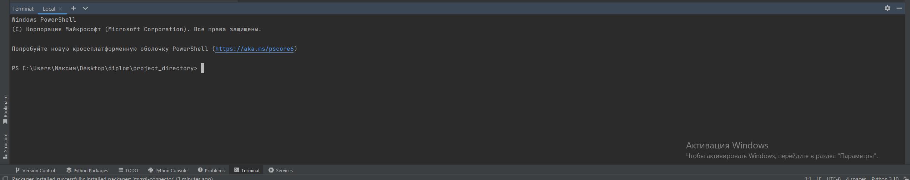

# diplom

## Описание

Данный дипломный проект представляет собой десктоп-приложение для контроля работы сотрудников в автомастерской. Программа написана на Python и позволяет отслеживать действия сотрудников путём создания сотрудниками отчётов, которые в следствии должны быть проверены. В приложении у сотрудника есть свой личный аккаунт, в котором он может создать новый отчёт или посмотреть свои предыдущие отчёты, а для работника проверяющего отчёты предусмотрено отдельное окно, в котором выводятся отчёты всех сотрудников.

## Установка

Для запуска десктоп-приложения выполните следующие шаги:
1. Установите PyCharm, скачать его можено тут - (https://www.jetbrains.com/pycharm/download/?section=windows)
2. Скачайте или клонируйте репозиторий: git clone - (https://github.com/maxim3364/diplom)
3. В программе PyCharm откройте данный проект.
4. Откройте терминал


5. установите все нужные модули:

```
pip install sqlite3
pip install messagebox
pip install datetime
```

## Дополнительные материалы

- [Ссылка на файл с текстовой частью дипломного проекта](https://docs.google.com/document/d/1le78G507Md6S0-av5wdMSuIY8azj1TgSZnxE4ehTXoo/edit)